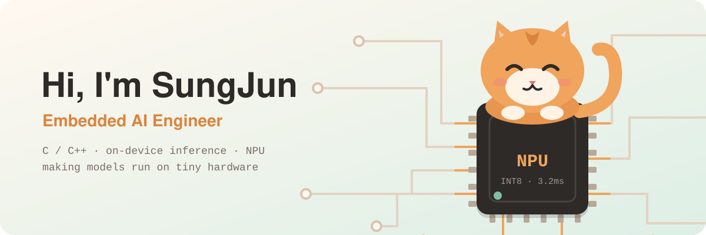

<picture>
  <source media="(prefers-color-scheme: dark)" srcset="assets/banner-dark.svg" />
  <source media="(prefers-color-scheme: light)" srcset="assets/banner-light.svg" />
  
</picture>

  

<picture>
  <source media="(prefers-color-scheme: dark)" srcset="assets/boot-dark.svg" />
  <source media="(prefers-color-scheme: light)" srcset="assets/boot-light.svg" />
  
</picture>

## 🧑‍💻 About Me

- 🔧 **Embedded AI engineer**: I port and optimize AI models to run on embedded devices
- ⚡ Writing **C / C++** for on-device inference, **Python** for model-side work
- 🤖 On the side, I build tooling for AI coding agents (**Claude Code**, **Codex**)
- 🌏 Based in Korea

## 🛠 Tech Stack

<picture>
  <source media="(prefers-color-scheme: dark)" srcset="https://skillicons.dev/icons?i=c,cpp,python,ts,js,go,rust,cmake,pytorch,tensorflow,linux,apple,githubactions,bun&perline=7&theme=dark" />
  <source media="(prefers-color-scheme: light)" srcset="https://skillicons.dev/icons?i=c,cpp,python,ts,js,go,rust,cmake,pytorch,tensorflow,linux,apple,githubactions,bun&perline=7&theme=light" />
  
</picture>

  

**On-device inference & hardware**

## 📊 GitHub Stats

<picture>
  <source media="(prefers-color-scheme: dark)" srcset="https://raw.githubusercontent.com/SungJun1217/SungJun1217/output/profile-3d-contrib/profile-night-green.svg" />
  <source media="(prefers-color-scheme: light)" srcset="https://raw.githubusercontent.com/SungJun1217/SungJun1217/output/profile-3d-contrib/profile-green-animate.svg" />
  
</picture>

<picture>
  <source media="(prefers-color-scheme: dark)" srcset="https://streak-stats.demolab.com?user=SungJun1217&hide_border=true&background=1B1917&ring=F0A45C&fire=F0A45C&currStreakLabel=F0A45C&sideLabels=EDE3D9&currStreakNum=EDE3D9&sideNums=EDE3D9&dates=A3968C&stroke=3A332E" />
  <source media="(prefers-color-scheme: light)" srcset="https://streak-stats.demolab.com?user=SungJun1217&hide_border=true&background=FFF8F0&ring=F0A45C&fire=F0A45C&currStreakLabel=D9853E&sideLabels=2E2A28&currStreakNum=2E2A28&sideNums=2E2A28&dates=7A6E66&stroke=E8D8C8" />
  
</picture>

## 🐍 Contributions

<picture>
  <source media="(prefers-color-scheme: dark)" srcset="https://raw.githubusercontent.com/SungJun1217/SungJun1217/output/github-snake-dark.svg" />
  <source media="(prefers-color-scheme: light)" srcset="https://raw.githubusercontent.com/SungJun1217/SungJun1217/output/github-snake.svg" />
  
</picture>

## 📫 Contact

